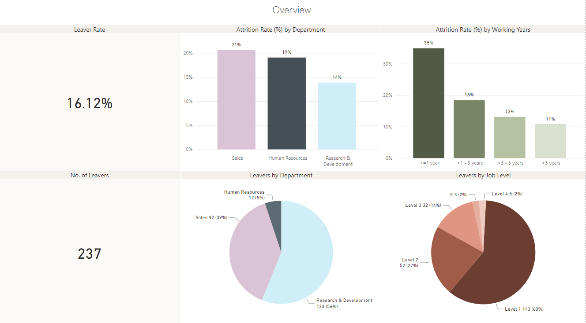
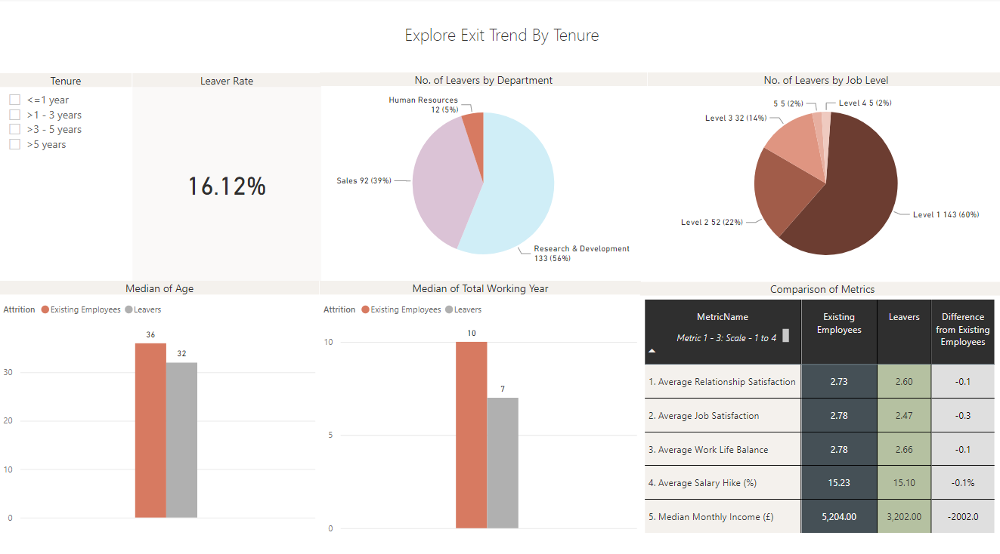
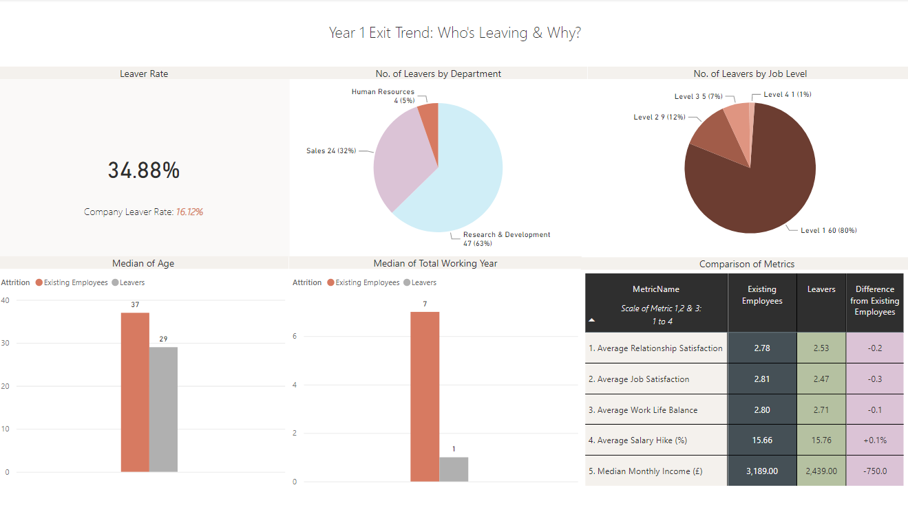

# HR leaver Analysis Dashboard

## 📋 Overview
This project explores patterns in employee leaver to help HR teams understand turnover drivers and design retention strategies. Built using Power BI and a simulated HR dataset.

## 🎯 Objectives
- Identify factors correlated with employee leaver (e.g., overtime, satisfaction, tenure)
- Visualize trends across departments, age groups, and job roles
- Provide actionable insights and HR recommendations

## ❓ Business Questions
- What factors contribute most to early employee leaver (within 1–2 years of joining)?
- Which groups of employees are most at risk of leaving, and how can HR better support them?
- Is our current process sufficient for the company to understand why employees are leaving and improve engagement?

## 🛠️ Tools & Technologies
- Power Query (for data cleaning and preparation)
- Power BI (for interactive dashboards)

## 📊 Dataset
- Source: [IBM HR Analytics Employee leaver & Performance](https://www.kaggle.com/datasets/pavansubhasht/ibm-hr-analytics-attrition-dataset)
- Size: 1,470 employee records
- Key Variables: Age, Department, MonthlyIncome, JobSatisfaction, WorkLifeBalance, RelationshipSatisfaction, YearsInCompany, Attrition, Job Level, 
⚠ Note: This dashboard assumes all data reflects employee records as of 2024. Tenure and attrition metrics are based on a snapshot without a time-series dimension. We assume that all of them left voluntarily, i.e. resignation.

## 🚀 Project Workflow
1. Data Cleaning (Power Query)
2. Exploratory Data Analysis (EDA)
3. Dashboard Development (Power BI)
4. Insights & Recommendations

## 🔍 Key Observations from Exploratory Data Analysis (EDA)

- **Level 1 employees are most likely to leave**: Entry-level staff show significantly higher leaver rates, highlighting a retention risk among early-career employees.

- **Leavers score slightly lower in satisfaction and support**: Job Satisfaction, Work-Life Balance, Relationship with Manager, and Salary Hike are all modestly lower among leavers compared to those who stayed.

- **The differences are not drastic**: These gaps (0.09–0.35 on a 4-point scale) suggest they may contribute to resignation but are unlikely to be the sole cause.

- **Hidden drivers may be influencing early resignation**: The high volume of exits from Year 1 employees — especially younger, less experienced staff — indicates possible issues like expectation mismatch, onboarding experience, or generation-related needs.

## 🔍 Dashboard Insights & Strategic Takeaways

### 📌 Page 1: Overview
<table>
  <tr>
    <td style="width: 50%; vertical-align: top;">
      
    </td>
    <td style="width: 50%; vertical-align: top;">
      <ul>
        <li><strong>Research & Development</strong> has the highest leaver rate across departments.</li>
        <li><strong>Job Level 1 employees</strong> show the highest leaver rate, indicating a risk among early-career staff.</li>
        <li>The overall leaver rate is concentrated within <strong>the first few years</strong> of employment.</li>
      </ul>
    </td>
  </tr>
</table>

### 📌 Page 2: Exit Trends (All Tenures)
<table>
  <tr>
    <td style="width: 50%; vertical-align: top;">
      
    </td>
    <td style="width: 50%; vertical-align: top;">
      <ul>
        <li>Majority of leavers fall within the <strong>1–3 year tenure group.</strong></li>
        <li>Leavers have slightly <strong>lower average scores</strong> in job satisfaction, work-life balance & relationship with manager</li>
        <li><strong>Median monthly income and salary hikes</strong> are slightly <strong>lower</strong> among leavers, but not drastically different.</li>
        <li>Leaver appears to be influenced by <strong>a combination of factors</strong>.</li>
      </ul>
    </td>
  </tr>
</table>

### 📌 Page 3: Year 1 Leaver Deep Dive

<table>
  <tr>
    <td style="width: 50%; vertical-align: top;">
      
    </td>
    <td style="width: 50%; vertical-align: top;">
      <ul>
        <li>Leaver rate of this population is significantly higher than the company wise attrition rate.</li>
        <li>High concentration of exits from <strong>Research & Development Level 1 employees</strong>.</li>
        <li>Majority of them are in their <strong>early careers</strong>.</li>
        <li>This suggests potential gaps in onboarding and support for employees in their early careers.</li>
      </ul>
    </td>
  </tr>
</table>

### ✅ Recommendations
- Conduct focus groups with early-tenure employees to better understand unmet expectations and early disengagement. We recommend to focus on Level 1 employees who are in their early career, working in Research & Development Department.
- Establish a structured exit interview process (if not already in place) to collect actionable, qualitative data on why employees choose to leave. That would decide the key initiatives that HR department should focus on.
- Review and enhance the onboarding program, focusing on the first-year experience; regularly collect feedback from new hires to identify improvement areas.
- Strengthen early career support and clearly communicate development opportunities to improve engagement and demonstrate long-term growth opportunities within the company.
  
## 📁 Folder Structure
```
HR-Attrition-Analysis/
├── PowerBI_Dashboard/
│   └── HR_Attrition_Dashboard.pbix
│
├── Data/
│   └── HR Data_20250501.csv
│
├── Screenshots/
│   └── Dashboard_Overview.png
```
